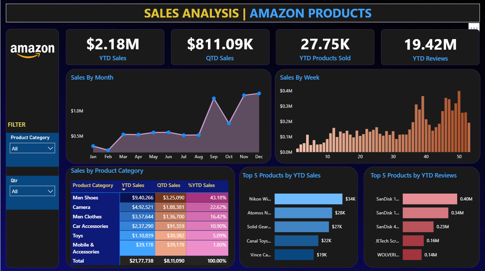

# 📦 Amazon Sales Analysis Dashboard | Power BI

An end-to-end Power BI dashboard analyzing Amazon product sales, reviews, and category performance across a **4-year, 89,000+ row transactional dataset (2019–2022)**. The report combines DAX time-intelligence measures with interactive visuals to surface YTD/QTD performance, top-selling products, and category-level trends.



---

## 🎯 Project Objective

Amazon-style e-commerce sellers need a single view of sales performance across product lines, time periods, and individual SKUs. This dashboard was built to answer:

- What are our **YTD / QTD sales, units sold, and reviews** at a glance?
- How does revenue **trend by month and by week**?
- Which **product categories** drive the most revenue, and what's their share of total sales?
- Which **individual products** are the top performers by sales and by customer reviews?

---

## 📊 Dashboard Features

| Section | Description |
|---|---|
| **KPI Cards** | YTD Sales, QTD Sales, YTD Products Sold, YTD Reviews |
| **Sales by Month** (Area Chart) | Monthly revenue trend across the fiscal year |
| **Sales by Week** (Column Chart) | Granular week-over-week sales momentum |
| **Sales by Product Category** (Matrix) | YTD Sales, QTD Sales, and % of Total YTD Sales per category |
| **Top 5 Products by YTD Sales** (Bar Chart) | Highest revenue-generating SKUs |
| **Top 5 Products by YTD Reviews** (Bar Chart) | Most-reviewed / most-engaged SKUs |
| **Slicers** | Product Category and Quarter, for dynamic filtering across all visuals |

---

## 🧾 Dataset

**Source file:** `Amazon_Combined_Data.xlsx`

| Attribute | Detail |
|---|---|
| Rows | ~89,000 transaction-level records |
| Date range | Jan 2019 – Dec 2022 |
| Columns | Product Category, Product Description, Price (Dollar), Number of Reviews, Shipment, Order Date |
| Categories covered | Men Shoes, Camera, Men Clothes, Car Accessories, Toys, Mobile & Accessories, Audio Video, Laptop |

A dedicated **Date Table** was built in Power Query/DAX (disconnected from the fact table's native date column) to correctly support time-intelligence calculations (Month Name, Week Number, Quarter).

---

## 🛠️ Tools & Tech Stack

- **Power BI Desktop** — data modeling, DAX, report design
- **Power Query (M)** — data cleaning and transformation
- **DAX** — time-intelligence measures (YTD/QTD)
- **Excel** — source dataset staging

---

## 📐 Key DAX Measures

Core measures driving the KPI cards and matrix visual, built with standard time-intelligence patterns against the custom Date Table:

```dax
YTD Sales = 
TOTALYTD ( SUM ( Amazon_Data[Price(Dollar)] ), 'Date Table'[Date] )

QTD Sales = 
TOTALQTD ( SUM ( Amazon_Data[Price(Dollar)] ), 'Date Table'[Date] )

YTD Products Sold = 
TOTALYTD ( COUNTROWS ( Amazon_Data ), 'Date Table'[Date] )

YTD Reviews = 
TOTALYTD ( SUM ( Amazon_Data[Number of  reviews] ), 'Date Table'[Date] )

% YTD Sales = 
DIVIDE ( [YTD Sales], CALCULATE ( [YTD Sales], ALL ( Amazon_Data[Product Category] ) ) )
```

---

## 📈 Key Insights

- **Men Shoes** is the top-performing category, contributing **43.18%** of YTD sales (**$9.40M**).
- **Camera** and **Men Clothes** follow, together contributing over **39%** of total YTD sales.
- Sales show a sharp seasonal uplift from **September through December**, suggesting strong Q4 / holiday-season demand.
- **Nikon** and **Atomos** products lead individual SKU performance by YTD sales, while **SanDisk** products dominate customer review volume — indicating high purchase frequency for accessories/storage items.

---

## 📁 Repository Structure

```
├── AMAZON_SALES_DASHBOARD.pbix     # Power BI report file
├── Amazon_Combined_Data.xlsx       # Source dataset
├── amazon_dashboard.png            # Dashboard screenshot
└── README.md
```

---

## 🚀 How to Use

1. Clone this repository.
2. Open `AMAZON_SALES_DASHBOARD.pbix` in **Power BI Desktop** (latest version recommended).
3. If prompted, update the data source path to point to `Amazon_Combined_Data.xlsx` on your local machine.
4. Use the **Product Category** and **Qtr** slicers to explore the data interactively.

---

## 👤 Author

**Ashmit Srivastava**
Aspiring Data Analyst | SQL · Python · Power BI · Excel

- GitHub: [ashgithub0208](https://github.com/ashgithub0208)
- LinkedIn: [ashmit-srivastava0208](https://linkedin.com/in/ashmit-srivastava0208)
- Email: ashmitsrivastava0208@gmail.com
